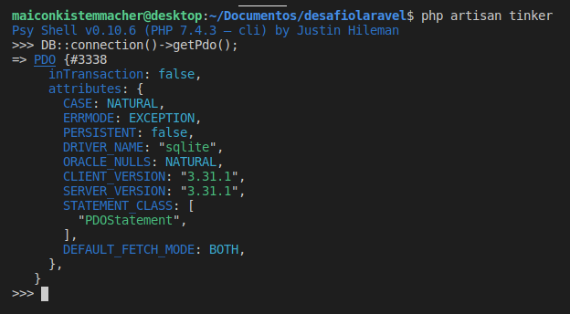

# Executar o projeto **desafiolaravel**
Para rodar o projeto em ambiente de desenvolvimento local, é necessário ter instalado o PHP,  Composer e algum servidor web. Instalar um pacote completo, como por exemplo XAMP ou WAMP pode ser mais fácil.

Requisitos: <https://laravel.com/docs/8.x/deployment#server-requirements>

`	`Download Composer: <https://getcomposer.org/download/>

- Clone do repositório: <https://github.com/maiconkistemmacher/desafiolaravel.git>
- Dar permissão na pasta raiz do projeto
- Rodar o comando: **composer update**
- Renomear o arquivo **env.example** para **.env**
- Rodar o comando: **php artisan serve**

# Instalação e configuração banco de dados **SQLITE**
- Rodar o comando: **sudo apt-get install sqlite3**
- Rodar o comando: **sudo apt-get install php-sqlite3**
- Criar o banco na pasta database: **touch database.sqlite**	
- Na pasta raiz do projeto: **php artisan tinker**
        >>> **DB::connection()->getPdo();**

Deve retornar um objeto PDO informando conexão OK:

#
# Executar o projeto **desafiolaravel** com[ DEVILBOX](http://devilbox.org/)
Devilbox é uma plataforma dockerizada para desenvolvimento em PHP, ele atua sendo um XAMP, porém fornece algumas ferramentas adicionais, como por exemplo, nginx, bind, redis, memcached, integração automática com os principais bancos de dados, e muito mais. O objetivo principal é facilitar o desenvolvimento local e também o deploy, pois ele permite que o ambiente criado sempre seja o mesmo, em qualquer máquina.

1. **Instalação e Configuração:**	
- Instalar docker: <https://docs.docker.com/engine/install/>
- Instalar compose: [https://docs.docker.com/compose/install/](https://docs.docker.com/compose/install/)
- Clone do repositório: 

<https://github.com/cytopia/devilbox>

- Permissão na pasta do devilbox
- Renomear o arquivo **env-example** para **.env**
- Configuração no arquivo **.env**, alterar/descomentar as linhas:

`			`TIMEZONE=**America/Sao\_Paulo**						HTTPD\_DOCROOT\_DIR=**public**

- Iniciar os containers: **sudo docker-compose up -d php httpd**

1. **Acessar o container PHP e instalar o Laravel:**

Rodar o comando: **sudo ./shell.sh**

<https://devilbox.readthedocs.io/en/latest/examples/setup-laravel.html>

Não é necessário instalar PHP, apache, ou qualquer outra dependência na nossa máquina local. A instalação do Laravel e demais ferramentas fica toda em containers. 

